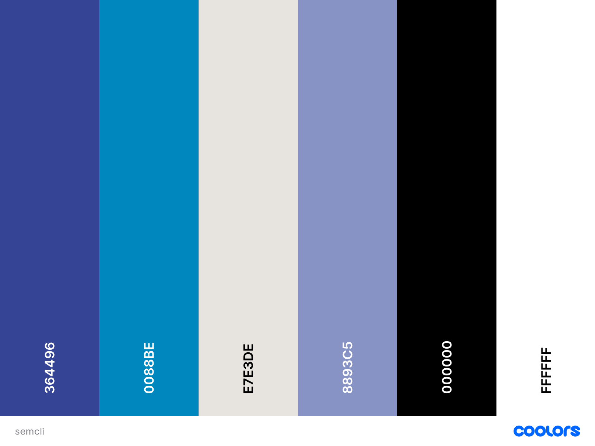

# Graphic Style Guide

## Fonts

Segoe UI https://learn.microsoft.com/en-us/typography/font-list/segoe-ui 

© 2018 Microsoft Corporation. All Rights Reserved.
Hebrew OpenType Layout logic copyright © 2003 & 2007, Ralph Hancock & John Hudson. This layout logic for Biblical Hebrew is open source software under the MIT License; see embedded license description for details.

font-family: -apple-system, BlinkMacSystemFont, "Segoe UI", Helvetica, Arial, sans-serif, "Apple Color Emoji", "Segoe UI Emoji", "Segoe UI Symbol";

## Colour palette

https://coolors.co/364496-0088be-e7e3de-8893c5-000000-ffffff

/* CSV */
364496,0088be,e7e3de,8893c5,000000,ffffff

/* With # */
#364496, #0088be, #e7e3de, #8893c5, #000000, #ffffff

/* Array */
["364496","0088be","e7e3de","8893c5","000000","ffffff"]

/* Object */
{"Marian blue":"364496","Blue (NCS)":"0088be","Platinum":"e7e3de","Cool gray":"8893c5","Black":"000000","White":"ffffff"}

/* Extended Array */
[{"name":"Marian blue","hex":"364496","rgb":[54,68,150],"cmyk":[64,55,0,41],"hsb":[231,64,59],"hsl":[231,47,40],"lab":[32,21,-47]},{"name":"Blue (NCS)","hex":"0088be","rgb":[0,136,190],"cmyk":[100,28,0,25],"hsb":[197,100,75],"hsl":[197,100,37],"lab":[53,-11,-37]},{"name":"Platinum","hex":"e7e3de","rgb":[231,227,222],"cmyk":[0,2,4,9],"hsb":[33,4,91],"hsl":[33,16,89],"lab":[90,0,3]},{"name":"Cool gray","hex":"8893c5","rgb":[136,147,197],"cmyk":[31,25,0,23],"hsb":[229,31,77],"hsl":[229,34,65],"lab":[62,8,-27]},{"name":"Black","hex":"000000","rgb":[0,0,0],"cmyk":[0,0,0,100],"hsb":[0,0,0],"hsl":[0,0,0],"lab":[0,0,0]},{"name":"White","hex":"ffffff","rgb":[255,255,255],"cmyk":[0,0,0,0],"hsb":[0,0,100],"hsl":[0,0,100],"lab":[100,0,0]}]

/* XML */
<palette>
  <color name="Marian blue" hex="364496" r="54" g="68" b="150" />
  <color name="Blue (NCS)" hex="0088be" r="0" g="136" b="190" />
  <color name="Platinum" hex="e7e3de" r="231" g="227" b="222" />
  <color name="Cool gray" hex="8893c5" r="136" g="147" b="197" />
  <color name="Black" hex="000000" r="0" g="0" b="0" />
  <color name="White" hex="ffffff" r="255" g="255" b="255" />
</palette>

